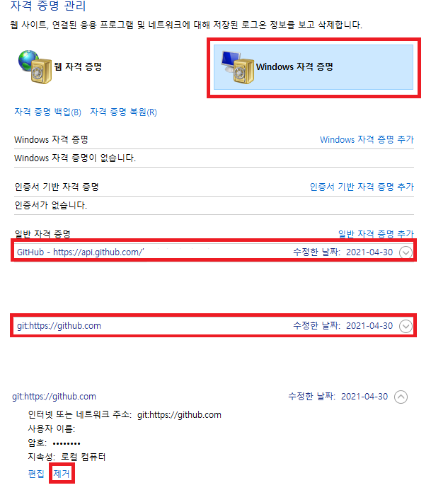

### 1. 로그인 계정 확인
git config user.name
git config user.email

### 2. 변경하고자 하는 이름과 계정을 입력한다.
git config --global user.name 이름
git config --global user.email 로그인할 이메일

### 3. 기존의 로그인 정보를 삭제한다.
'제어판' >> '사용자 계정' >> '자격 증명 관리'에 들어간다.
'Windows 자격 증명'에서 기존 계정과 관련된 것을 지워준다.

### 4. push 명령어를 입력하고 로그인한다.
